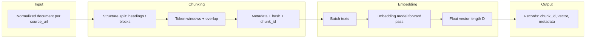

# Chunking & Embedding Architecture

This document specifies **how text is split into chunks** and **how those chunks are turned into vectors** for the mutual fund FAQ RAG system. It complements the end-to-end design in [rag-architecture.md](./rag-architecture.md) (ingest pipeline, GitHub Actions scheduler, scraping).

**Pipeline placement:** `normalized text (per URL)` → **chunking** → **embedding** → `vector + metadata` → index upsert (see main doc §4.6).

---

## 1. Objectives

| Goal | Implication |
|------|-------------|
| Retrievable facts | Chunks must keep **numeric and tabular context** (expense ratio, loads, minimums) attached to the right scheme and section. |
| Stable updates | Re-runs after daily scrape should **re-embed only changed chunks** (content-hash gate). |
| Single embedding space | **One model, one dimension** for all Phase 1 chunks so every vector is comparable at query time. |
| Small corpus | Five Groww HTML pages: favor **clarity and determinism** over heavy semantic chunkers. |

---

## 2. End-to-End Flow (Chunking + Embedding)

---

## 3. Chunking — Detailed Design

### 3.1 Inputs

- **One `metrics.json`** per allowlisted URL after Phase 4.3 ([rag-architecture.md](./rag-architecture.md) §4.3): structured `metrics` (NAV, minimum SIP, fund size, expense ratio, rating) plus **`retrieval_text`** (single factual string for embedding).
- **Required carry-over fields** from upstream: `source_url`, `fetched_at`, `doc_type` (Phase 1: **`groww_scheme_metrics`**), `scheme_name`, `http_status`. For Phase 1, chunking may use **`retrieval_text` as a single chunk** per scheme unless you split by sentence for overlap experiments.

### 3.2 Representation before splitting

- Prefer an **ordered list of blocks** produced by the parser, not one flat string:
  - **Heading blocks** (`level`, `text`) — preserve hierarchy for `section_path`.
  - **Paragraph blocks** — plain text.
  - **List blocks** — items kept together when short; otherwise split by item if lists are huge (unlikely on scheme pages).
  - **Table blocks** — serialize as **Markdown-style or TSV lines** with a header row so row boundaries stay clear for the embedder.

This structure makes splitting **deterministic** and easier to debug than “split on characters only.”

### 3.3 Stage A — Structure-aware grouping

1. Walk blocks top-to-bottom. Maintain a **section stack** from headings (e.g. `Fund overview > Key metrics`).
2. **Merge** consecutive blocks into **segments** under the current `section_path` until a segment would exceed the **maximum chunk tokens** (Stage B), then finalize a chunk and continue with overlap (Stage B).
3. **Never split a single table across two chunks** if the serialized table fits under `max_chunk_tokens`. If a table is too large (rare):
   - Split on **row groups** (e.g. every *n* data rows) and **repeat the header** in each sub-table chunk so metrics stay interpretable.
4. **Scheme identity:** Prefix or tag chunk text with a light **context header** only if needed for disambiguation at retrieval time, e.g. first chunk per URL may include `Source: {source_url}` in metadata only—not always duplicated in `text` to save tokens. Prefer **metadata filters** over duplicating URL in every chunk’s body.

### 3.4 Stage B — Token limits and overlap

- **Tokenizer:** Use the **same tokenizer the embedding model expects** (or a close proxy):
  - Local: model’s `tokenizer` / `max_seq_length` from the card.
  - API: provider’s documented max input tokens.
- **Parameters (defaults; tune with eval):**

| Parameter | Recommended start (Phase 1) | Notes |
|-----------|-----------------------------|--------|
| `max_chunk_tokens` | 512 | Stay under model’s limit; scheme pages are short. |
| `min_chunk_tokens` | ~50 | Avoid tiny noisy chunks; merge small tail with previous if possible. |
| `overlap_tokens` | 50–80 (~10–15% of max) | Preserves sentences split at window boundary. |

- **Procedure:**
  1. After Stage A, if a segment is still longer than `max_chunk_tokens`, **hard-split** the segment using sentence boundaries (e.g. simple regex or `syntok`-style splitter), then pack sentences into windows of ≤ `max_chunk_tokens`.
  2. For each window after the first, **prepend the last `overlap_tokens`** of the previous window (token-aligned, not character-aligned).
  3. Drop chunks below `min_chunk_tokens` unless they contain **numeric/table** content (regex / table detector)—those are kept for factual retrieval.

### 3.5 Chunk record schema (pre-embedding)

Each chunk is a record used for embedding and storage:

| Field | Type | Description |
|-------|------|-------------|
| `chunk_id` | string (stable) | e.g. `sha256(source_url + "\n" + section_path + "\n" + chunk_index)` or UUID v5 from same inputs—**stable across runs** if content unchanged. |
| `source_url` | string | Allowlisted page URL. |
| `fetched_at` | ISO 8601 | From scrape time. |
| `doc_type` | string | Phase 1: **`groww_scheme_metrics`**. |
| `section_path` | string | Human-readable path, e.g. `Key information > Expense ratio`. |
| `chunk_index` | int | Order within the document (0-based). |
| `text` | string | Final text passed to the embedder. |
| `content_hash` | string | `sha256(text)` for **change detection** and deduplication. |
| `token_count` | int | Tokens for `text` (for logging and validation). |

**Idempotency:** On daily ingest, if `(source_url, content_hash)` already exists in the index with the same embedding model version, **skip** re-embedding that chunk and only refresh `fetched_at` if you adopt a “touch” policy.

### 3.6 Quality checks (chunking)

- **Non-empty:** Every URL must yield at least one chunk; alert if zero.
- **No giant blobs:** Flag chunks within 5% of `max_chunk_tokens` that lack structure (possible parser regression).
- **Table sanity:** If table serialization produces fewer than two lines, log warning (possible DOM change on Groww).

---

## 4. Embedding — Detailed Design

### 4.1 Model policy

- **Single model** for Phase 1 for all chunks and for **query vectors** at runtime: **`BAAI/bge-small-en-v1.5`** (**384**-dimensional outputs with **L2-normalized** vectors for cosine similarity).
- Record **`embedding_model_id`** (`BAAI/bge-small-en-v1.5`) and **`embedding_dim`** (`384`) in index metadata / `corpus-manifest.json` (see `ingestion/phase-4-5-embedding/`).
- **Changing the model** requires a **full re-embed** of the corpus and bumping a **model version** flag so retrieval never mixes incompatible vectors.

### 4.2 Execution modes

| Mode | When to use | Chunking interaction |
|------|-------------|----------------------|
| **Local (Python)** | GitHub Actions or self-hosted runner with CPU; small corpus | Load model once per job; batch encode on CPU. |
| **Managed API** | Prefer ops simplicity; low volume | Send `text` batches; respect rate limits and max tokens per request. |

**GitHub Actions note:** Default hosted runners are **CPU-only**. For Phase 1 (~tens of chunks), a small sentence-transformers model on CPU is typically sufficient. If latency or size grows, move embedding to a GPU runner or API.

### 4.3 Batching

- **Batch size:** As large as memory allows on the runner (e.g. 16–64 chunks for small models); for APIs, follow provider limits (e.g. 2048 dims × N texts per call).
- **Truncation:** If any `text` still exceeds model max length after chunking, **truncate from the end** and log a `truncation=true` flag on that chunk (should be rare if §3.4 is enforced).

### 4.4 Vector post-processing

- If the model or DB expects **L2-normalized** vectors (common for cosine similarity), **normalize** after encoding for consistency with the **query-time** path.
- Store vectors as `float32` (or `float16` if the DB supports it and precision is acceptable).

### 4.5 Embedding record (post-embedding)

Extends the chunk record with:

| Field | Type | Description |
|-------|------|-------------|
| `embedding` | `float[D]` | Dense vector. |
| `embedding_model_id` | string | Model name / version. |
| `embedded_at` | ISO 8601 | When the vector was produced. |

### 4.6 Chroma upsert (index storage — Phase 4.6)

Vector indexing uses **[Chroma](https://www.trychroma.com/)** as the system of record for embeddings + metadata (see [rag-architecture.md](./rag-architecture.md) §4.6). Use the official **`chromadb`** client; deployment can be **persistent local path**, **self-hosted server**, or **[Chroma Cloud](https://www.trychroma.com/)**. **Ingest CLI:** `ingestion/phase-4-6-chroma/` → `python -m chroma_service` (reads Phase 4.5 `embedded_chunks.json`, upserts, emits `chroma-ingest-report.json` + `corpus-version.txt`).

**Collection**

- Create or get a **collection** with name convention fixed for the app (e.g. `mf_faq_groww_metrics`).
- Set **embedding dimension** to **384** and a **distance / space** consistent with **L2-normalized** cosine similarity (per Chroma version API—validate in implementation).
- **Do not** ask Chroma to re-embed at ingest: pass **precomputed** vectors from Phase 4.5.

**Upsert payload (per chunk)**

| Chroma field | Source |
|--------------|--------|
| `ids` | `chunk_id` (stable string) |
| `embeddings` | `embedding` from `embedded_chunks.json` |
| `documents` | chunk `text` |
| `metadatas` | `source_url`, `scheme_name`, `slug`, `fetched_at`, `content_hash`, `doc_type`, `embedding_model_id`, etc. (use types Chroma accepts—string/number/bool; flatten or stringify as needed) |

**Strategies**

1. **Upsert by `chunk_id`:** For each ingest run, call **`upsert`** with full records. Optionally **delete** ids that are no longer present for a retired URL.
2. **Replace per `source_url`:** Query/delete existing ids for that URL, then add fresh rows (good when `chunk_id` can change if chunking rules change).
3. **Small corpus shortcut:** **Delete** the collection and **recreate** with the latest `embedded_chunks.json` set (acceptable for five funds during early development).

After a successful write, persist **`corpus_version`** (hash of sorted `(chunk_id, content_hash)` or monotonic counter) in a **sidecar file** or Chroma **collection metadata**, aligned with `corpus-manifest.json` from Phase 4.5.

### 4.7 Operational metrics

- Count: `chunks_total`, `chunks_skipped_unchanged`, `chunks_embedded`, `chunks_failed`, **`chroma_upserted`**.
- Timing: scrape duration, chunk duration, embed duration, **Chroma upsert duration**.
- Emit as workflow summary or structured logs for dashboards.

---

## 5. Query-Time Symmetry (Retrieval)

- **Same `embedding_model_id`** and preprocessing (normalize, truncate rules) for the **user query** as for chunks.
- **BGE query prompt:** Apply the **query** template from the [bge-small-en-v1.5 model card](https://huggingface.co/BAAI/bge-small-en-v1.5) when encoding user questions; **passages** in Chroma were stored with plain passage encoding (ingest path).
- **Dimension `D`** must match stored vectors exactly (**384**).
- **Chroma:** Use the same collection and distance metric as at ingest; pass the query vector explicitly (**no** default embedding function mismatch with Phase 4.5).

---

## 6. Failure Handling

| Failure | Behavior |
|---------|----------|
| Embedder OOM / API 429 | Reduce batch size; exponential backoff; fail job after N retries. |
| Partial URL scrape failure | Chunk only successful URLs; leave prior index rows for failed URL until next success (policy from main doc §4.2). |
| All embeds fail | Fail workflow; do not swap `corpus_version` to a half-built index. |

Use **atomic index switch** where it matters for production: e.g. ingest into a **staging** Chroma collection (or DB path), **query validate**, then **swap** the application config to point at the new collection or copy/rename per Chroma deployment patterns. For tiny corpora, recreating a single collection after a successful pipeline may be sufficient.

---

## 7. Summary

Chunking is **structure-first** (headings, tables, lists), then **token windows with overlap**, with **stable `chunk_id`** and **`content_hash`** for efficient daily refreshes. Embedding uses **one fixed model** (`BAAI/bge-small-en-v1.5`), **batched inference**, and **L2-normalized** vectors. **Chroma** stores vectors, document text, and metadata; ingest **upserts** from `embedded_chunks.json` so the scheduled pipeline produces a **consistent, versioned** retrieval index aligned with [rag-architecture.md](./rag-architecture.md) §4.6.
