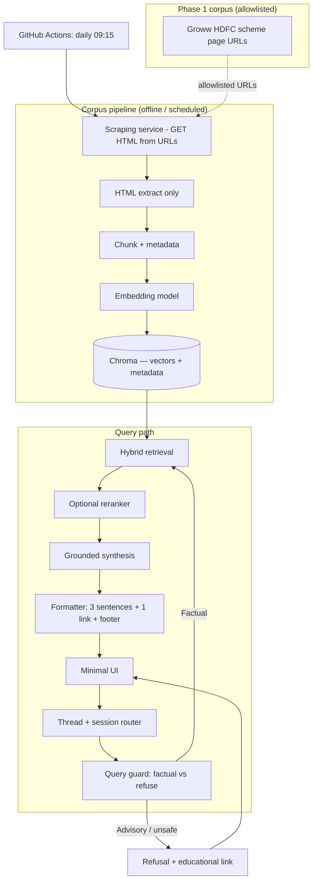

# RAG Architecture — Facts-Only Mutual Fund FAQ Assistant

This document describes a **Retrieval-Augmented Generation (RAG)** architecture for the Groww-context mutual fund FAQ assistant defined in [problemstatement.md](./problemstatement.md). The design prioritizes **verifiability, compliance, and source grounding** over open-ended reasoning.

**Related:** Scheduled ingest uses **GitHub Actions** (§4.1). **Chunking and embedding** are specified in depth in [chunking-embedding-architecture.md](./chunking-embedding-architecture.md).

---

## 1. Design Principles

| Principle | Implication for RAG |
|-----------|---------------------|
| Facts-only | Retrieval is the primary truth source; the LLM **synthesizes and compresses**, never invents numbers or policy details. |
| Single official citation | Each answer is tied to **one** retrieved chunk (or merged chunk set) whose **canonical URL** is exposed to the user. |
| No advice | Classifier + prompt rules **refuse** comparative and “should I” queries before or instead of retrieval. |
| Privacy | No PII in logs or stores; session/thread IDs are opaque; optional ephemeral chat history. |
| Lightweight | **Phase 1:** five allowlisted Groww scheme pages; **indexed facts** limited to **NAV, minimum SIP, fund size (AUM), expense ratio, Groww rating** (see §3.1 / §4.3). |

---

## 2. High-Level System Architecture



**Components at a glance**

- **Scheduler**: **GitHub Actions** workflow runs **once per day at 09:15** in the chosen timezone (see §4.1) to pull the **latest** page HTML and refresh the index.
- **Scraping service**: Fetches each allowlisted URL, returns raw HTML (and metadata such as status code and fetch time) to the rest of the ingest pipeline.
- **Corpus pipeline** (post-scrape): Normalizes, chunks, embeds, and **upserts into [Chroma](https://www.trychroma.com/)** (§4.6).
- **Runtime path**: Routes each user message through safety/factuality gates, retrieves grounded passages, generates a constrained answer, and returns formatted output with citation and “last updated” stamp.

---

## 3. Corpus Definition & Governance

### 3.1 Scope — this project (Phase 1)

- **AMC anchor:** HDFC Mutual Fund (schemes presented on Groww).
- **Category mix:** large-cap, mid-cap, focused, diversified equity, and ELSS — **five schemes**, one URL each.
- **Formats:** **HTML only.** There are **no PDFs** in the corpus for this phase (no factsheet/KIM/SID PDF ingestion). If PDFs are added later, they become a separate ingest path and allowlist entries.
- **Allowlisted scheme pages (RAG corpus):**
  - [HDFC Mid Cap Fund — Direct Growth](https://groww.in/mutual-funds/hdfc-mid-cap-fund-direct-growth)
  - [HDFC Equity Fund — Direct Growth](https://groww.in/mutual-funds/hdfc-equity-fund-direct-growth)
  - [HDFC Focused Fund — Direct Growth](https://groww.in/mutual-funds/hdfc-focused-fund-direct-growth)
  - [HDFC ELSS Tax Saver — Direct Plan Growth](https://groww.in/mutual-funds/hdfc-elss-tax-saver-fund-direct-plan-growth)
  - [HDFC Large Cap Fund — Direct Growth](https://groww.in/mutual-funds/hdfc-large-cap-fund-direct-growth)

**Note:** [problemstatement.md](./problemstatement.md) describes a broader target (e.g., 15–25 official AMC/AMFI/SEBI URLs). Phase 1 intentionally narrows ingestion to the list above; expansion is a configuration + ingest change, not a runtime change.

**Facts stored per scheme (Groww page):** The corpus for Q&A is restricted to these **five** fields (as shown on each allowlisted URL / in Groww’s embedded page data):

| Field | Meaning | Typical source on page |
|-------|---------|-------------------------|
| **NAV** | Net asset value per unit (₹) + **as-of date** | Latest NAV |
| **Minimum SIP** | Minimum SIP instalment (₹) | SIP / investment minimums |
| **Fund size** | AUM in **₹ crore** | Fund size / AUM |
| **Expense ratio** | Total expense ratio (**% p.a.**) | TER |
| **Rating** | **Groww** risk–reward style rating (**n / 10**), when present | Groww rating |

Other page content (holdings tables, return calculators, peer ranks, etc.) is **not** written to the normalized store—only the above metrics plus metadata (`source_url`, `fetched_at`, `scheme_name`, hashes) for traceability and RAG.

### 3.2 Allowlist

- Maintain an explicit **URL allowlist** (and optional path prefixes) in configuration or a small registry table. **Phase 1:** the five Groww URLs in §3.1, plus any separate URLs used only for **refusal / educational** responses (e.g., AMFI/SEBI) if those are not indexed for RAG.
- **Reject** at ingest time any URL not on the allowlist; **do not** crawl the open web.

### 3.3 Document types & parsing

| Type | Format (Phase 1) | Extraction notes |
|------|------------------|------------------|
| Groww mutual fund scheme page | HTML (scrape) → **JSON metrics** | Parse embedded `__NEXT_DATA__` → `props.pageProps.mfServerSideData`. Persist **only** NAV (+ date), minimum SIP, AUM (fund size, ₹ Cr), expense ratio (%), Groww rating. `doc_type`: **`groww_scheme_metrics`**. Output file: `metrics.json` per scheme (see §4.3). |
| Factsheet / KIM / SID | *Not in corpus* | PDF (or AMC HTML) can be added later with a dedicated parser and allowlist entries. |
| AMC FAQ / help; AMFI / SEBI | *Optional, not in Phase 1 RAG corpus* | Use for refusal/educational links or future index expansion. |

### 3.4 Versioning & “last updated”

- Store per-document metadata: `source_url`, `document_type`, `fetched_at`, `content_hash`, optional `http_last_modified`.
- The user-facing line `Last updated from sources: <date>` should reflect **either** the fetch timestamp for the chunk used **or** a corpus-level refresh date—pick one rule and apply consistently (recommended: **max(`fetched_at`) among chunks used in the answer**).

---

## 4. Ingestion Pipeline (Indexing)

### 4.1 Scheduler (GitHub Actions)

- **Platform:** **GitHub Actions** (`on: schedule`) runs the full ingest workflow **every day at 09:15** in the timezone you intend (see below).
- **Cron and UTC:** `schedule.cron` in GitHub Actions uses **UTC** only. Convert **09:15 local** to UTC in the workflow. Example: **09:15 Asia/Kolkata (IST, UTC+5:30)** → **03:45 UTC** → `cron: '45 3 * * *'`. Document the mapping in a workflow comment so maintainers know the intended local time.
- **Workflow contents (typical jobs):**
  1. **Checkout** repo (ingest scripts, allowlist config).
  2. **Setup** runtime (e.g. Python) and install dependencies.
  3. **Scrape** allowlisted URLs (§4.2); fail the job if critical steps break per your policy.
  4. **Normalize → chunk → embed** — behavior and parameters: [chunking-embedding-architecture.md](./chunking-embedding-architecture.md).
  5. **Upsert Chroma** (§4.6) and bump **`corpus_version`** (local persistent path, self-hosted server, or [Chroma Cloud](https://www.trychroma.com/) per deployment).
- **Concurrency:** Use `concurrency: group: ingest` (or similar) so **only one ingest run** executes at a time; avoids overlapping daily runs with `workflow_dispatch` manual runs.
- **Secrets:** Store API keys in **GitHub Actions secrets**; never commit secrets. For **Chroma Cloud** on the scheduled ingest workflow, set **`CHROMA_CLOUD_TENANT`**, **`CHROMA_CLOUD_DATABASE`**, and **`CHROMA_API_KEY`** (same values as local `phase-4-6-chroma/.env`). Without them, CI still runs the pipeline but Phase 4.6 writes only to an ephemeral on-runner persistent store.
- **Outputs:** Workflow summary or logs with per-URL status; optional Slack/email on failure.
- **Manual run:** `workflow_dispatch` triggers the **same** jobs as the schedule for on-demand refresh.
- **Runner limits:** Default GitHub-hosted runners are **CPU-only**; Phase 1 corpus size fits **CPU embedding** (see chunking/embedding doc). For heavy models, use a larger runner or an external embedding API.

### 4.2 Scraping service

- **Role:** For each URL in the allowlist (§3.1), **retrieve the current public HTML** over HTTPS—this is the only component that talks to **groww.in** for corpus refresh (and any future allowlisted hosts).
- **Scope:** **No general crawling.** Only configured URLs; do not follow outbound links to build the corpus.
- **Respect** `robots.txt` and site terms for **groww.in** (and any future domains on the allowlist).
- **HTTP:** GET (optionally `If-Modified-Since` / ETag if you want to skip unchanged bodies), timeouts, retries with backoff on transient failures, record **HTTP status** and **`fetched_at`** per URL.
- **Rate limiting:** Polite concurrency (e.g. serial or small pool); identifiable user-agent if required.
- **Raw storage (optional):** Short-TTL raw HTML for audit/debug—if stored, **encrypt at rest**; pages are public and must remain **PII-free**.
- **Failure policy:** If a URL fails, log and alert; either **retain previous successful snapshot** for that URL until the next successful run or mark chunks as stale according to product rules.

### 4.3 Normalization (key metrics only)

- **Input:** Raw HTML from §4.2 (`body.html` per slug).
- **Extraction:** Read Groww **Next.js** payload `__NEXT_DATA__` → `mfServerSideData` and map:
  - **NAV** ← `nav`, **as of** ← `nav_date`
  - **Minimum SIP** ← `min_sip_investment` (₹)
  - **Fund size** ← `aum` (interpreted as **₹ crore** as displayed by Groww)
  - **Expense ratio** ← `expense_ratio` (% p.a.; coerce string/number)
  - **Rating** ← `groww_rating` (integer **1–10** when present; may be `null`)
- **Output:** **`metrics.json` only** (no full-page text, no holdings/returns tables). Include `retrieval_text`: a single short factual string built from the five fields for downstream **chunking/embedding**.
- **Integrity:** `normalized_content_sha256` over canonical JSON of `metrics` + `source_url` + `scheme_name`.
- **Strict mode:** If any of NAV, minimum SIP, AUM, or expense ratio cannot be parsed, the normalize step **fails** when `NORMALIZE_STRICT=1` (CI default).
- **PDF:** Not used in Phase 1.

### 4.4 Chunking strategy (summary)

- **Phase 1:** With only **`retrieval_text`** per scheme (~1 short passage), chunking is usually **one chunk per fund** (or trivial sentence splits). `doc_type` on chunks: **`groww_scheme_metrics`**.
- **Implementation:** `ingestion/phase-4-4-chunking/` reads each `metrics.json`, emits **`chunks.json`** (chunk records per [chunking-embedding-architecture.md](./chunking-embedding-architecture.md) §3.5) and `chunk-run-report.json`. Env: `CHUNK_STRICT`, optional `CHUNK_SPLIT_SENTENCES` for multi-chunk sentence splits.
- **Downstream vectors:** Chunk `text` is embedded in §4.5 with **`BAAI/bge-small-en-v1.5`** (384-dim, L2-normalized passages for retrieval).
- For larger normalized documents later: structure-aware splits (headings, lists, tables), token windows with overlap, stable `chunk_id`, and `content_hash` — **full specification:** [chunking-embedding-architecture.md](./chunking-embedding-architecture.md) §3.

### 4.5 Embeddings (summary)

- **Model (Phase 1):** **`BAAI/bge-small-en-v1.5`** via [sentence-transformers](https://www.sbert.net/) — **384 dimensions**, **`normalize_embeddings=True`** for cosine similarity. Same model family at query time; **queries** should use the BGE *query* instruction string at runtime (see model card); **corpus** side uses plain chunk text (passage encoding).
- **Implementation:** `ingestion/phase-4-5-embedding/` reads `chunks.json`, writes **`embedded_chunks.json`** per slug, plus **`embed-run-report.json`** and **`corpus-manifest.json`**. Env: `EMBED_STRICT`, `EMBEDDING_MODEL_ID` (default `BAAI/bge-small-en-v1.5`), `EMBED_BATCH_SIZE`.
- **Detail:** [chunking-embedding-architecture.md](./chunking-embedding-architecture.md) §4.

### 4.6 Index storage — [Chroma](https://www.trychroma.com/)

Phase 1 uses **[Chroma](https://www.trychroma.com/)** as the **vector + metadata** store (open-source search infrastructure; Apache 2.0). See also [Chroma docs](https://docs.trychroma.com/) for Python/JS clients and deployment modes.

**Role**

- Persist **384-d** embeddings (`BAAI/bge-small-en-v1.5`) and **metadata** required for retrieval, citations, and filtering (`chunk_id`, `source_url`, `scheme_name`, `content_hash`, `fetched_at`, `doc_type`, `slug`, etc.).
- Serve **similarity search** at query time (dense retrieval); Phase 1 corpus is tiny (~5 chunks), but Chroma scales if the corpus grows.

**Deployment options (choose per environment)**

| Mode | Typical use |
|------|-------------|
| **Embedded / persistent** | `chromadb` **PersistentClient** with an on-disk path (local dev, single-node ingest). |
| **Client–server** | Chroma server + **HttpClient** / gRPC (shared DB for API + workers). |
| **Chroma Cloud** | Managed service from the same project ([trychroma.com](https://www.trychroma.com/)); use Cloud credentials and endpoint in CI/production. |

**Collection design**

- **One logical collection** for the FAQ corpus (e.g. `mf_faq_groww_metrics`), with embedding dimension **384** and distance aligned with **L2-normalized** vectors (e.g. **cosine** similarity where supported).
- **Record id:** stable **`chunk_id`** from Phase 4.4 (unique per chunk).
- **Document body:** store chunk **`text`** (or `retrieval_text` lineage) so Chroma can return passages without a second store.
- **Metadata:** all fields needed for **source link**, **last updated**, and optional **`where`** filters (e.g. by `source_url` / scheme).

**Ingest (after Phase 4.5)**

- Read **`embedded_chunks.json`** (or equivalent) and **`upsert`** ids + embeddings + documents + metadatas into the collection.
- **Reference implementation:** `ingestion/phase-4-6-chroma/` (`python -m chroma_service`) — writes **`chroma-ingest-report.json`** (includes upsert duration, slug/chunk counts, optional echo of Phase 4.5 **`corpus-manifest.json`**), **`corpus-version.txt`**, and either a **persistent** DB under `data/chroma_db`, **`CHROMA_HTTP_HOST`** for a self-hosted server, or **Chroma Cloud** via **`CHROMA_CLOUD_TENANT`**, **`CHROMA_CLOUD_DATABASE`**, **`CHROMA_API_KEY`** (see `phase-4-6-chroma/.env.example`). Optional **`CHROMA_RECREATE_COLLECTION=1`** for full collection refresh on tiny corpora.
- **Refresh strategy:** for each daily run, either **replace** vectors per `source_url` / `chunk_id`, or **delete-and-reinsert** the collection for this small corpus; then bump **`corpus_version`** (see [chunking-embedding-architecture.md](./chunking-embedding-architecture.md) §4.6).

**Optional later**

- Chroma supports **lexical / sparse** search (e.g. BM25-style workflows per their product surface); Phase 1 can stay **dense-only**. Revisit hybrid retrieval (§5.2) if you add sparse vectors in Chroma.

---

## 5. Runtime: Retrieval

### 5.1 Query preprocessing

- **Thread context**: Maintain per-thread short history (last *k* turns) for follow-ups (“What about its exit load?”) with **scheme entity** carried in structured state when possible.
- **Query expansion (conservative)**: Optional synonym map for MF terms (e.g., “TER” → “total expense ratio”) without adding new facts.

### 5.2 Hybrid retrieval

1. **Dense retrieval**: Embed the user query with **`BAAI/bge-small-en-v1.5`** (BGE **query** instruction per model card), then **query [Chroma](https://www.trychroma.com/)** for top-*k* (e.g., *k* = 8–20; Phase 1 may return fewer records). Return `documents` + `metadatas` + distances for grounding.
2. **Sparse retrieval** (optional): BM25 / lexical in Chroma or a side index, if enabled later.
3. **Fusion**: Reciprocal Rank Fusion (RRF) or weighted union; dedupe by `source_url` + overlapping text.

### 5.3 Filtering

- If the user names a scheme, **filter** metadata to that scheme when labels exist; otherwise rely on retrieval + reranking.
- Prefer metadata filters for intent classes (e.g., “lock-in” → chunks from the ELSS scheme URL or sections tagged ELSS).

### 5.4 Reranking (optional, still “lightweight”)

- Cross-encoder or small reranker on top 20 → top 5 chunks to improve table/numeric alignment.

### 5.5 Grounding package

- Pass to the generator: **top 1–3 chunks** (strict grounding) rather than the full top-20 to reduce hallucination.
- **Policy**: If confidence is low (no chunk above similarity threshold), return **“I couldn’t find this in the indexed official sources”** + link to the most relevant **allowlisted** landing page (e.g., scheme factsheet URL from registry), not a guess.

---

## 6. Runtime: Generation & Guardrails

### 6.1 Query guard (refusal handling)

**Before retrieval** (cheap) or **in parallel**:

- **Advisory / comparative** patterns: “should I”, “better fund”, “which one to pick”, implied personalized advice.
- **Performance chasing**: “best returns”, “will it go up”—map to refusal or **factsheet-only** pointer per problem statement.

**Refusal output** (per spec):

- Polite, clear **facts-only** restatement.
- **Exactly one** educational link (AMFI/SEBI allowlisted URL).

### 6.2 Grounded synthesis prompt contract

The LLM receives:

- User question (and optional resolved scheme).
- Retrieved chunk text(s) with `source_url` and `fetched_at`.
- Hard rules:
  - Use **only** provided passages for factual claims.
  - **Maximum 3 sentences.**
  - **Exactly one** citation URL in the body (the canonical `source_url` of the primary chunk).
  - No advice, no comparisons, no predictive language.
  - For performance questions: only point to official factsheet per policy.

### 6.3 Post-generation validation (recommended)

- **Citation check**: URL in the answer ∈ allowlist and matches selected chunk URL.
- **Sentence count** ≤ 3 (rule-based or lightweight model).
- **Numeric consistency** (optional): if answer cites a number, it must appear in the retrieved chunk (regex / fuzzy match).

If validation fails: one **repair** pass with stricter instructions or fall back to templated answer: short quote-style summary + link.

### 6.4 Footer

- Append: `Last updated from sources: <date>` using the rule defined in §3.4.

### 6.5 Provider configuration (Phase 6)

- Phase 6 generation uses **Google Gemini** via the `google-genai` client and the configured model (default: `gemini-2.5-flash`).
- Configure runtime secrets in `ingestion/phase-6-generation/.env`:
  - `GEMINI_API_KEY`
  - `GEMINI_MODEL` (optional override; default `gemini-2.5-flash`)
- Keep generation retries with short backoff for transient provider throttling/errors; if retries fail, return a graceful fallback response with citation URL.

---

## 7. Multi-Thread / Multi-Conversation Support

### 7.1 Thread model

- Each conversation has a `thread_id` (opaque UUID). No user PII in thread records.
- **Server-side state per thread**:
  - Recent messages (bounded buffer).
  - Optional **entity slot**: `{ amc, scheme_ids[], last_doc_type }` updated from user text or button selections.

### 7.2 Isolation

- Retrieval and generation are **stateless** except for thread context; logs include `thread_id` only.
- Rate limits per IP / per thread to prevent abuse.

### 7.3 Concurrency

- Stateless API tier scales horizontally; vector DB and LLM calls are the main bottlenecks.
- Consider **per-thread semaphores** if using single-tenant API keys with strict QPS.

---

## 8. API & Service Boundaries (Suggested)

| Service | Responsibility |
|---------|----------------|
| **Scheduler** | **GitHub Actions** `schedule` workflow: **daily 09:15** in the intended timezone (cron expressed in **UTC**); `concurrency` to prevent overlapping runs; optional `workflow_dispatch`. |
| **Scraping service** | Fetches **latest HTML** from each allowlisted URL; returns bodies + per-URL fetch metadata to the ingest pipeline. |
| **Ingestion worker** | After scrape: normalize, chunk, embed, then **`ingestion/phase-4-6-chroma/`** Chroma upsert ([chunking-embedding-architecture.md](./chunking-embedding-architecture.md) §4.6), bump **corpus version**; same path for `schedule` and `workflow_dispatch`. |
| **Retrieval API** | `POST /retrieve` — debug/admin only in production. |
| **Chat API** | `POST /chat` with `thread_id`, message → streamed or full reply. |
| **Admin** | Allowlist editor, trigger re-ingest, view corpus version (optional). |

Internal DTO example for a turn:

```json
{
  "thread_id": "uuid",
  "user_message": "What is the exit load for Scheme X?",
  "retrieved_chunks": [
    {
      "chunk_id": "…",
      "source_url": "https://…",
      "fetched_at": "2026-04-21T00:00:00Z",
      "text": "…"
    }
  ],
  "decision": "answer | refuse | insufficient_evidence",
  "answer": "…",
  "citation_url": "https://…"
}
```

---

## 9. Security, Privacy, and Compliance

- **No PII collection** (per spec): do not ask for PAN, Aadhaar, accounts, OTP, email, phone in the assistant UI.
- **Logging**: Log message length hashes or redacted snippets; avoid full verbatim logging in production if not needed.
- **Prompt injection**: Treat retrieved text as **untrusted data**; instructions that “override policy” should be neutralized by system prompt priority and **output validation**.
- **Content safety**: Block illegal / harmful requests; financial compliance is primarily **non-advisory** behavior + **source-backed** answers (Phase 1 citations are the indexed Groww scheme URLs).
- **Sourcing stance:** The product brief references Groww as context; Phase 1 retrieval is limited to the allowlisted Groww pages. Aligning with “official documents only” from the problem statement can be a **later** corpus upgrade (AMC/AMFI/SEBI URLs) without changing the overall RAG shape.

---

## 10. Observability & Quality

- **Metrics**: retrieval hit rate, refusal rate, validation failure rate, latency p95, corpus version per answer.
- **Eval set**: 30–50 golden questions with expected **source URL** and allowed numeric answers from corpus snapshots.
- **Regression**: On each ingest, run automated checks that critical URLs still resolve and chunks are non-empty.

---

## 11. Technology Options (Lightweight Stack)

| Layer | Example options |
|-------|-----------------|
| Backend | Python (FastAPI) or Node (Express/Fastify) |
| Vector DB | **[Chroma](https://www.trychroma.com/)** (`chromadb`) — persistent, server, or Cloud |
| Embeddings | **`BAAI/bge-small-en-v1.5`** (sentence-transformers), 384-d, normalized; see `ingestion/phase-4-5-embedding/` |
| LLM | **Google Gemini** (Phase 6 default: `gemini-2.5-flash`) for synthesis; temperature low in prompts where applicable (e.g., 0.1–0.3) |
| Scheduler | **GitHub Actions** — `on: schedule` with UTC cron (e.g. 09:15 IST → `45 3 * * *`); `concurrency` group; secrets for DB/API |
| UI | Minimal React/Vite or server-rendered pages |

---

## 12. Known Limitations (Architectural)

- **Corpus coverage**: Phase 1 indexed content is **only the five key-metric records** (NAV, SIP, AUM, expense ratio, rating) per scheme—not full factsheets, holdings, or return history. Questions outside those facts will hit **insufficient evidence** or refusal paths. **Scheduled refresh** still applies when Groww updates `mfServerSideData`.
- **No PDFs in Phase 1**: Regulatory and numeric detail that exists only in PDFs is **not** in the index until PDFs (or AMC HTML equivalents) are added to the allowlist and parser.
- **Groww payload changes**: Normalization depends on `__NEXT_DATA__` / `mfServerSideData` field names; Groww app updates can break parsing—monitor normalize job and extend `metrics_extract.py` if needed.
- **Ambiguous scheme names**: With five fixed URLs, disambiguation is simpler; if the corpus grows, similar names across AMCs may need UI hints or explicit AMC context.
- **LLM drift**: Without validation, models can still over-generalize; **chunk-grounding + citation checks** are mandatory, not optional.

---

## 13. Mapping to Deliverables

| Deliverable | Where in this architecture |
|-------------|------------------------------|
| README + setup | `.github/workflows/` ingest through **4.6** (`ingestion/phase-4-6-chroma/`), **Chroma** persist path or HTTP host ([chunking-embedding-architecture.md](./chunking-embedding-architecture.md)) |
| Selected AMC & schemes | Corpus registry config consumed by ingestion |
| Architecture overview | This document + high-level diagram; chunking/embedding detail in [chunking-embedding-architecture.md](./chunking-embedding-architecture.md) |
| Disclaimer in UI | Static banner; mirrored in system prompt |
| Multi-chat threads | §7 |
| Success criteria (accuracy, citations, refusals) | §5–§6 + §10 eval |

---

## 14. Summary

This RAG architecture uses a **small, allowlisted corpus** (Phase 1: **five metric snapshots** per scheme from Groww: NAV, minimum SIP, fund size, expense ratio, rating), **[Chroma](https://www.trychroma.com/)** for **vector + metadata** storage, **dense retrieval with conservative grounding** (hybrid/sparse optional later), and a **strict generation contract** (three sentences, one link, dated footer) to meet facts-only mutual fund FAQ requirements. **Refusal handling** is a first-class stage, not an afterthought. **Multi-thread support** is implemented via opaque thread IDs and bounded per-thread state without collecting personal data—aligning retrieval strength with transparency and compliance goals as the corpus expands.
